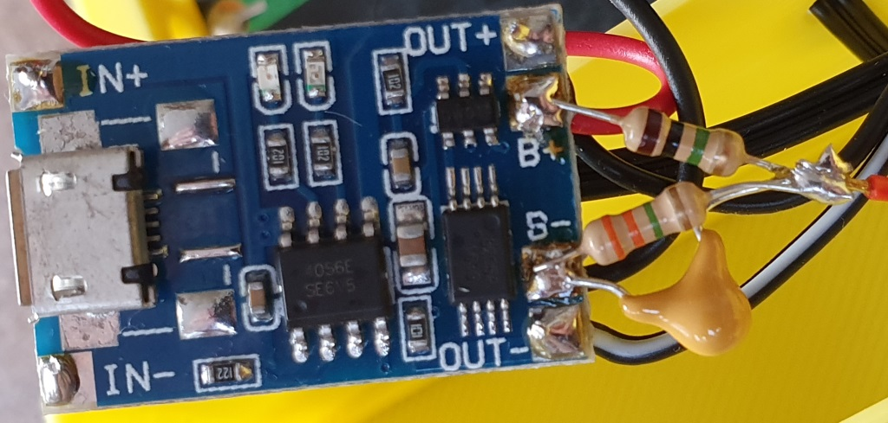

# EspBatteryLightSensor
Values from a TSL2561 are read and sent to an MQTT broker. The battery powered ESP8266 will only do the reading/sending, if the voltage is high enough.

## NodeMCU
To get your device running, you might want to use theese tools:
- [https://esp8266.ru/esplorer/](https://esp8266.ru/esplorer/) - ESPlorer
- [https://nodemcu-build.com/](https://nodemcu-build.com/) - NodeMCU custom build

During development don't upload the init.lua yet. Be sure that the device is working as expected and then upload the init.lua to start automatically.

## Hardware Setup
TODO
- ESP8266 (Wemos D1)
- TP4065
- Solar Panel (6V 1W 110x60mm)

### Voltage measuring
In case the voltage of the battery is too low, we do not want to drain any more energy out of it.

This great article helped me to measure the voltage without draining the battery.
[https://jeelabs.org/2013/05/16/measuring-the-battery-without-draining-it/](https://jeelabs.org/2013/05/16/measuring-the-battery-without-draining-it/).

My interpretation of the above article looks like this:


### Deep Sleep
The ESP will go to deep sleep after measuring to save energy. If no battery is connected, it will not sleep. This enables you to flash the firmware or work with the files on the device.

### TSL2561
Everything that is connected to VCC will always be "online" and put load on the battery. We want to operate as long as possible. Therefore it makes sense to only apply voltage to the sensor when it is used.

The TSL2561 uses a maximum of 0.6mA which can easily be delivery by an IO of the ESP8266 (12mA). So we hook up the VCC of the sensor to D5 on the Wemos D1 Mini and set it to HIGH when the sensor is needed.

## Config file
The config file *config.lua* is not included in the repository. You will need to create one, adjust the parameters and upload it together with the other files.
```lua
local module = {}

module.pins = {}
module.pins.sda = 2
module.pins.scl = 1
module.pins.activateTsl = 5

module.maxLux = 45000

module.voltage = {}
module.voltage.multiplicator = 0.4
module.voltage.minimum = 3.2

module.wifi = {}
module.wifi.ssid = 'ssid'
module.wifi.password = 'key'

module.mqtt = {}
module.mqtt.url = "ip address"
module.mqtt.deviceId = "LightSensor1"
module.mqtt.topics = {}
module.mqtt.topics.light = 'light/1/lumen'
module.mqtt.topics.voltage = 'light/1/voltage'

return module
```